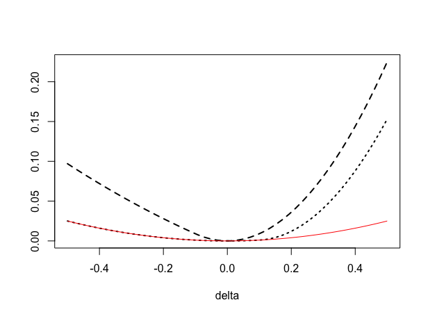

[](http://quantlet.de/)

## [](http://quantlet.de/) **Expectile_RSC** [](http://quantlet.de/)

```yaml

Name of QuantLet : Expectile_RSC

Published in : FASTEC-with-Expectiles

Description : 'Illustrates the restricted strong convexity property of expectile loss function with
a particular example. The red line shows the lower error bounds.'

Keywords : expectile, loss function, convexity, error bound, plot

See also : FASTECSAMCVaR, FASTECChinaTemper2008, FASTEC_with_Expectiles

Author : Shih-Kang Chao, Chen Huang

Submitted : Sun, May 14 2017 by Chen Huang

Example : 'tau = 0.9, error = 0.1 or -0.1 for the two dash lines, the deviation delta varies from
-0.5 to -0.5.'

```




### R Code:
```r
delf = function(u, tau, delta) {
    abs(tau - as.numeric(u + delta < 0)) * (u + delta)^2 - abs(tau - as.numeric(u < 
        0)) * u^2 - 2 * (tau - as.numeric(u < 0)) * abs(u) * delta
}

del = seq(-0.5, 0.5, length = 50)
tau = 0.9
u   = 0.1
plot(del, delf(u = u, tau = tau1, delta = del), type = "l", lty = 2, lwd = 2, xlab = "delta", 
    ylab = "")
lines(del, delf(u = -u, tau = tau1, delta = del), lty = 3, lwd = 2)
lines(del, min(tau1, 1 - tau1) * del^2, col = "red")

```
