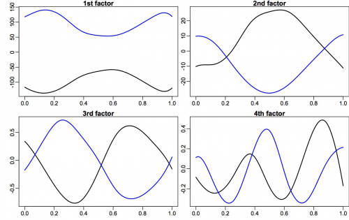
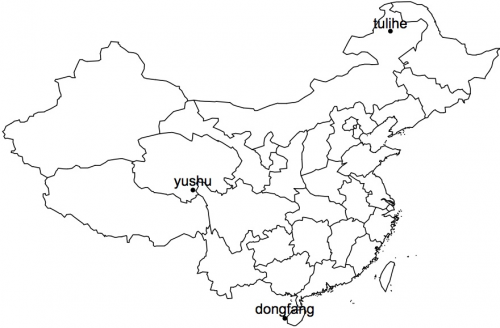
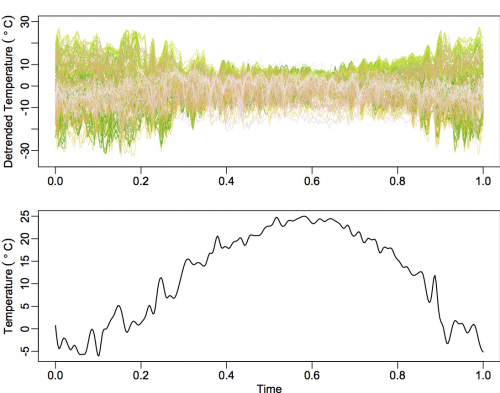
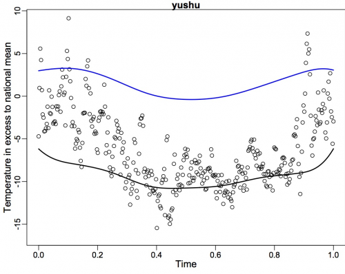
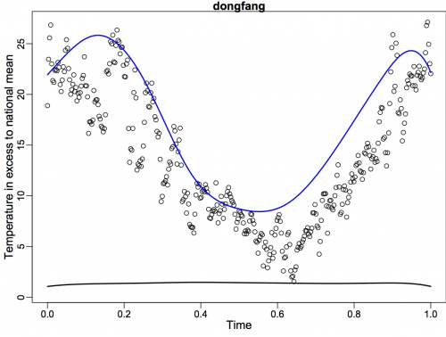
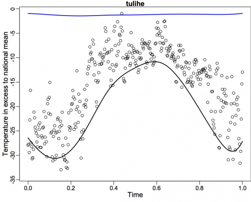
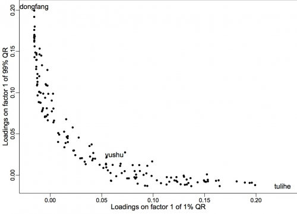

[](http://quantlet.de/)

## [](http://quantlet.de/) **FASTECChinaTemper2008** [](http://quantlet.de/)

```yaml

Name of QuantLet : FASTECChinaTemper2008

Published in : FASTEC-with-Expectiles

Description : 'Reproduces the empirical results of Chinese temperature of 2008 in the paper FASTEC,
Factorizable sparse tail event curves by Chao, Haerdle and Yuan (2015), including plot of
temperature curves and tau-spread analysis.'

Keywords : LASSO, quantile regression, sparse, nuclear norm, tail, variable selection

See also : FASTECSAMCVaR, LCPvariance

Author : Shih-Kang Chao

Submitted : Wed, March 2 2016 by Chen Huang

Datafile : ChinaTemperature2008.txt, stations_info.txt

```
















### R Code:
```r

# clear history
rm(list = ls(all = TRUE))
graphics.off()

# install and load packages
libraries = c("splines", "maps", "mapdata", "matrixStats")
lapply(libraries, function(x) if (!(x %in% installed.packages())) {
  install.packages(x)
})
lapply(libraries, library, quietly = TRUE, character.only = TRUE)

##################### Function: SFISTA algorithm ########################################
mqr = function(Y, X, tau, lambda, epsilon = 10^(-6), itt = 2000) {
  ### Initialize ################
  m           = ncol(Y)
  n           = nrow(Y)
  p           = ncol(X)
  X2norm      = norm(X, type = "2")
  kappa       = 1e-04  # instead of epsilon/(2*m*n) by theory, like Chen,Lin,Kim,Carbonell and Xing we use fixed kappa, the value we choose here is equivalent to epsilon = 50.
  L           = X2norm^2/(kappa * m^2 * n^2)
  Omega       = matrix(0, nrow = p, ncol = m)
  delta       = 1      # step size
  error       = 1e+07
  L.error     = 1e+10
  it          = 1
  ### Output ###################
  A           = matrix(0, nrow = p, ncol = m)
  A_          = matrix(0, nrow = p, ncol = m)
  ### Main iteration #########
  while (it < itt & error > epsilon) {
    S         = svd(Omega - L^(-1) * G.qr(Omega, Y, X, tau, kappa, m = m, n = n), nu = p, nv = m)
    temp.sv   = S$d - (lambda/L)
    temp.sv[temp.sv < 0] = 0
    A         = S$u %*% diag(temp.sv, nrow = p, ncol = m) %*% t(S$v)
    delta.for = (1 + sqrt(1 + 4 * delta^2))/2
    Omega     = A + (delta - 1)/(delta.for) * (A - A_)
    error     = L.error - (sum((tau - matrix(as.numeric(Y - X %*% A < 0), n, m)) * 
      (Y - X %*% A)) + lambda * sum(temp.sv))  # Before: Put abs around to ensure that it is positive (just in case)
    L.error   = sum((tau - matrix(as.numeric(Y - X %*% A < 0), n, m)) * (Y - X %*% 
      A)) + lambda * sum(temp.sv)
    A_        = A
    delta     = delta.for
    it        = it + 1
    print(c(error, delta, sum((tau - matrix(as.numeric(Y - X %*% A < 0), n, m)) * 
      (Y - X %*% A)), sum(temp.sv)))
    # if(it < 10){error=1000000}
  }
  list(Gamma = A, d = S$d, U = S$u, V = S$v, error = error, loss = sum((tau - matrix(as.numeric(Y - 
    X %*% A < 0), n, m)) * (Y - X %*% A)), norm = sum(temp.sv), lambda = lambda, iteration = it)
}
##################### Function: Computing the gradient of the loss function ##############
G.qr = function(A, Y, X, tau, kappa, m, n) {
  W          = (m * n * kappa)^(-1) * (Y - X %*% A)
  index_p    = which(W > tau, arr.ind = TRUE)
  W[index_p] = tau
  index_n    = which(W < tau - 1, arr.ind = TRUE)
  W[index_n] = tau - 1
  temp       = (-t(X) %*% W)/(m * n)
  temp
}

##################### Function: Estimation of penalizing parameter 'lambda' #############
simtune = function(m, tau, X, alpha = 0.1, B = 500) {
  sim.lambda      = numeric(0)
  n               = nrow(X)
  for (i in 1:B) {
    W.temp        = matrix(as.numeric(runif(n * m) < tau) - tau, nrow = n, ncol = m)
    temp.score    = norm(t(X) %*% W.temp/n, type = "2")
    sim.lambda[i] = temp.score/m
    lam           = quantile(sim.lambda, p = (1 - alpha))
  }
  list(sim.lambda = sim.lambda, lambda = lam)
}

##################### Input Data ########################################
temper   = read.table("ChinaTemperature2008.txt")
name     = read.table("stations_info.txt")
name.sta = name$V2[-1]
name     = name[-1, ]
#################### Parameter ########################################
p = ceiling(365^0.4)
n = 365
#################### Main Code #########################################
xx    = seq(0, 1, length = 365)
X.fac = bs(xx, df = p, intercept = TRUE)
X     = matrix(0, nrow = n, ncol = 0)
for (i in 1:p) {
  X   = cbind(X, X.fac[, i])
}
k     = 0
Y     = data.matrix(temper)  # transform from data frame to matrix
m     = dim(Y)[2]
sig_x = sqrt(norm(X, type = "F")/n)
TAU   = c(0.01, 0.5, 0.99)
################# Remove trend ############################################
YY        = numeric(0)
for (i in 1:m) {
  YY      = c(YY, Y[, i])
}
XX        = rep(xx, times = m)
fit.trend = smooth.spline(x = XX, y = YY)
Y         = Y - fit.trend$y  # Remove trend
######################## Main code ################################################################
tau              = 0.01
alpha            = 0.1
sim.lambda       = numeric(0)
B                = 1000
set.seed(1001)
for (i in 1:B) {
  W.temp         = matrix(as.numeric(runif(n * m) < tau) - tau, nrow = n, ncol = m)
  temp.score     = norm(t(X) %*% W.temp/n, type = "2")
  sim.lambda[i]  = temp.score/m
}
lamb             = 2 * quantile(sim.lambda, p = 0.9)

system.time(fit1 <- mqr(Y = Y, X = X, tau = TAU[1], epsilon = 1e-06, lambda = lamb, itt = 1000))
system.time(fit3 <- mqr(Y = Y, X = X, tau = TAU[3], epsilon = 1e-06, lambda = lamb, itt = 1000))

################### Discussion ################################################


##### Individual station plot

cur1      = X %*% fit1$Gamma
cur3      = X %*% fit3$Gamma

##
par(mfrow = c(1, 1),           # 2x2 layout
    oma   = c(1, 1, 0, 0),     # two rows of text at the outer left and bottom margin
    mar   = c(2, 1.8, 1, 0),   # space for one row of text at ticks and to separate plots
    mgp   = c(1.5, 0.5, 0),    # axis label at 2 rows distance, tick labels at 1 row
    xpd   = NA )
no.sta    = 98
plot(xx, Y[, no.sta], main = name.sta[no.sta], ylab = "Temperature in excess to national mean", 
  xlab = "Time", cex.lab = 1.2, ylim = c(min(Y[, no.sta]) - 1, max(Y[, no.sta])))
lines(xx, cur1[, no.sta], lwd = 1.5)
lines(xx, cur3[, no.sta], col = "blue", lwd = 1.5)

### Station code to put into 'no.sta'
which(name.sta == "haerbin")        # 22
which(name.sta == "huoshan")        # 33
which(name.sta == "jinzhou")        # 8
which(name.sta == "xiwuzhumuqinqi") # 102
which(name.sta == "sunwu")          # 16
which(name.sta == "tulihe")         # 88
which(name.sta == "haikou")         # 68
which(name.sta == "dongfang")       # 69
which(name.sta == "yushu")          # 141
which(name.sta == "jiexiu")         # 86
which(name.sta == "tianjin")        # 82


################################################ factors ###########################
library(matrixStats)
pc1            = X %*% fit1$U %*% diag(fit1$d, nrow = p, ncol = m)
pc3            = X %*% fit3$U %*% diag(fit3$d, nrow = p, ncol = m)

varipc1        = colVars(pc1)
varipc3        = colVars(pc3)

par(mfrow      = c(2, 2),         # 2x2 layout
    oma        = c(0, 1, 0, 0),   # two rows of text at the outer left and bottom margin
    mar        = c(2, 1.8, 1, 0), # space for one row of text at ticks and to separate plots
    mgp        = c(1.5, 0.5, 0),  # axis label at 2 rows distance, tick labels at 1 row
    xpd        = NA )             # allow content to protrude into outer margin (and beyond)
plot(xx, pc1[, 1], type = "l", lwd = 1.2, main = "1st factor", xlab = "", ylab = "", 
  ylim = c(min(pc1[, 1]), max(-pc3[, 1])), )
lines(xx, -pc3[, 1], lty = 1, lwd = 1, col = "blue")

plot(xx, pc1[, 2], type = "l", lwd = 1.2, main = "2nd factor", xlab = "", ylab = "", 
  ylim = c(min(-pc3[, 2]), max(pc1[, 2])))
lines(xx, -pc3[, 2], lty = 1, lwd = 1, col = "blue")

plot(xx, pc1[, 3], type = "l", lwd = 1.2, main = "3rd factor", xlab = "", ylab = "", 
  ylim = c(min(pc1[, 3]), max(-pc3[, 3])))
lines(xx, -pc3[, 3], lty = 1, lwd = 1, col = "blue")

plot(xx, pc1[, 4], type = "l", lwd = 1.2, main = "4th factor", xlab = "", ylab = "", 
  ylim = c(min(-pc3[, 4]), max(pc1[, 4])))
lines(xx, -pc3[, 4], lty = 1, lwd = 1.2, col = "blue")

########## Temperature time series + first factors tau=1%, 99% ###########################
par(mfrow = c(2, 1),           # 2x2 layout
    oma   = c(0.3, 1, 0, 0),   # two rows of text at the outer left and bottom margin
    mar   = c(2, 1.8, 1.2, 0), # space for one row of text at ticks and to separate plots
    mgp   = c(1.5, 0.5, 0),    # axis label at 2 rows distance, tick labels at 1 row
    xpd   = NA )               # allow content to protrude into outer margin (and beyond)
plot(xx, Y[, 1], lwd = 1.3, ylab = expression(paste("Detrended Temperature ", (~degree ~ 
  C))), xlab = "", ylim = c(-35, 30), type = "l", col = "white")
for (k in 1:m) {
  lines(xx, Y[, k], col = terrain.colors(m)[k], lwd = (m - k + 1) * 1/m)
}
plot(xx, pc1[, 1], type = "l", lwd = 1.2, main = "1st Factor", xlab = "Time", ylab = "", 
  ylim = c(min(pc1[, 1]), max(-pc3[, 1])), )
lines(xx, -pc3[, 1], lty = 1, lwd = 1, col = "blue")

##### Temperature time series + trend ####### 
par(mfrow = c(2, 1),           # 2x2 layout
    oma   = c(0.3, 1, 0, 0),   # two rows of text at the outer left and bottom margin
    mar   = c(2, 1.8, 1.2, 0), # space for one row of text at ticks and to separate plots
    mgp   = c(1.5, 0.5, 0),    # axis label at 2 rows distance, tick labels at 1 row
    xpd   = NA )               # allow content to protrude into outer margin (and beyond)
plot(xx, Y[, 1], lwd = 1.3, cex.lab = 1, cex.axis = 1, xlab = "", ylab = expression(paste("Detrended Temperature ", 
  (~degree ~ C))), ylim = c(-35, 30), type = "l", col = "white")
for (k in 1:m) {
  lines(xx, Y[, k], col = terrain.colors(m)[k], lwd = (m - k + 1) * 1/m)
}
plot(fit.trend$x, fit.trend$y, lwd = 1.4, cex.lab = 1, cex.axis = 1, ylab = expression(paste("Temperature ", 
  (~degree ~ C))), xlab = "Time", type = "l")
#######################  Firm's loadings on factors #####################################################
load1     = t(fit1$V)[, order(varipc1, decreasing = TRUE)]
load3     = -t(fit3$V)[, order(varipc3, decreasing = TRUE)]  # minus sign in the front because 90 factor is flipped

par(mfrow = c(1, 1),         # 2x2 layout
    oma   = c(1, 1, 0, 0),   # two rows of text at the outer left and bottom margin
    mar   = c(2, 1.8, 0, 0), # space for one row of text at ticks and to separate plots
    mgp   = c(1.5, 0.5, 0),  # axis label at 2 rows distance, tick labels at 1 row
    xpd   = NA )

### tau spread analysis
standout  = c(159)
middle    = 79
plot(load1[1, ], load3[1, ], col = "white", xlab = "Loadings on factor 1 of 1% QR", 
  ylab = "Loadings on factor 1 of 99% QR", xlim = c(-0.02, 0.23), cex.lab = 1.2)
points(sort(load1[1, ])[-standout], load3[1, order(load1[1, ])][-standout], pch = 20)
points(load1[1, order(load3[1, ])][standout], sort(load3[1, ])[standout], pch = 20, col = "white")
points(load1[1, order(load3[1, ])][middle], sort(load3[1, ])[middle], pch = 20, col = "white")
text(sort(load1[1, ])[standout], load3[1, order(load1[1, ])][standout], labels = name.sta[order(load1[1, 
  ])][standout], cex = 1.2)
text(load1[1, order(load3[1, ])][standout], sort(load3[1, ])[standout], labels = name.sta[order(load3[1, 
  ])][standout], cex = 1.2)
text(load1[1, order(load3[1, ])][middle], sort(load3[1, ])[middle], labels = name.sta[order(load3[1, 
  ])][middle],   cex = 1.2)

#### Three sample extreme locations on map ######
index = c(141, 69, 88)
x.cor = as.numeric(data.matrix(name$V4)[c(141, 69, 88)])/100
y.cor = as.numeric(data.matrix(name$V3)[c(141, 69, 88)])/100

library(maps)
library(mapdata)
par(mfrow = c(1, 1),         # 2x2 layout
    oma   = c(1, 1, 0, 0),   # two rows of text at the outer left and bottom margin
    mar   = c(2, 1.8, 0, 0), # space for one row of text at ticks and to separate plots
    mgp   = c(1.5, 0.5, 0),  # axis label at 2 rows distance, tick labels at 1 row
    xpd   = NA )
map("china")
points(x.cor, y.cor, lwd = 0.5, pch = 20)
for (i in 1:3) {
  text(x.cor[i], y.cor[i] + 0.9, labels = name.sta[index[i]])
} 

```
