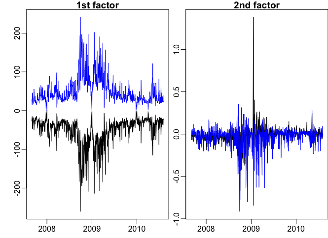
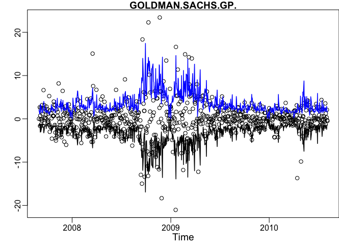
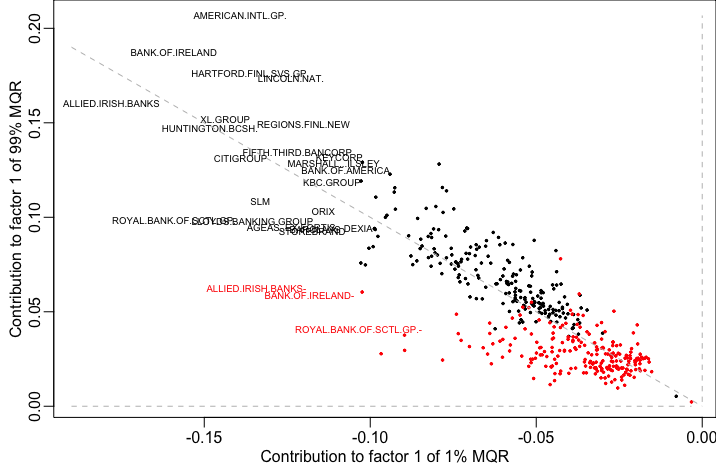
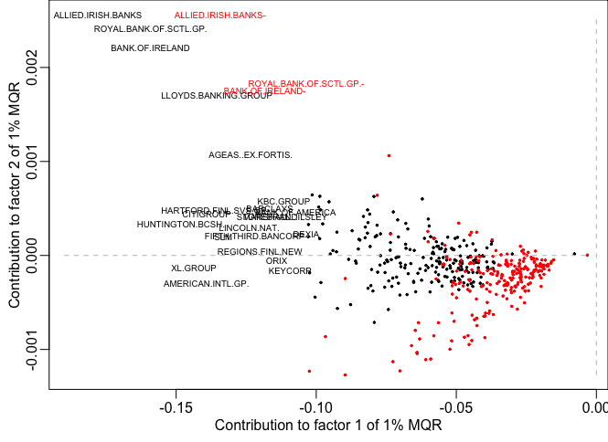
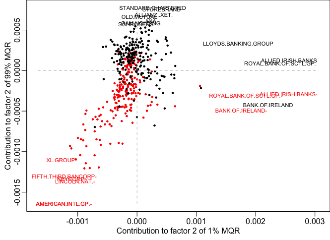
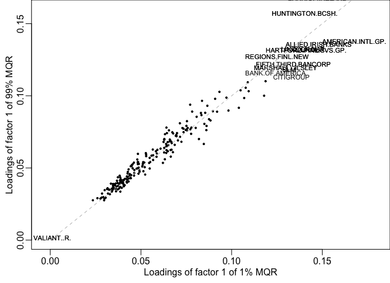
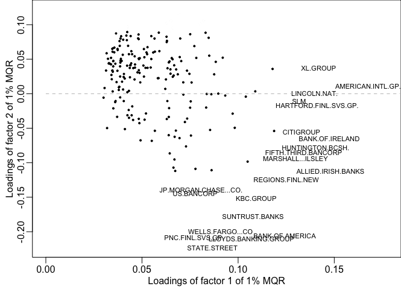
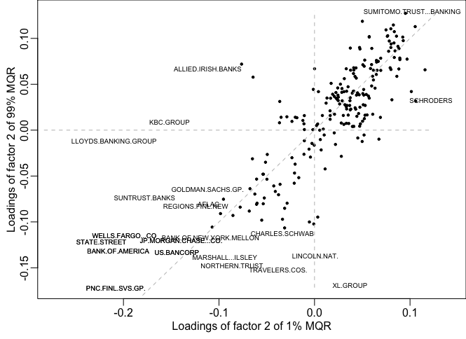
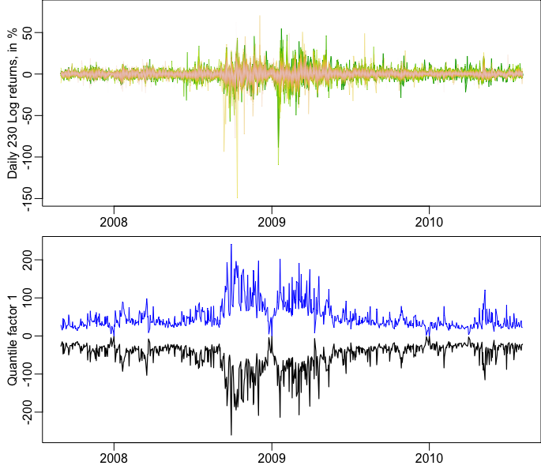
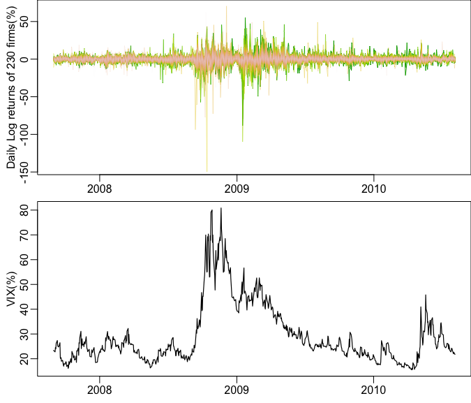

[](http://quantlet.de/)

## [](http://quantlet.de/) **FASTECSAMCVaR** [](http://quantlet.de/)

```yaml

Name of QuantLet : FASTECSAMCVaR

Published in : FASTEC-with-Expectiles

Description : 'Reproduces the empirical results of financial data in the paper FASTEC, Factorizable
sparse tail event curves by Chao, Haerdle and Yuan (2015), including plot of daily log returns of
230 firms and tau-spread analysis.'

Keywords : LASSO, quantile regression, sparse, nuclear norm, tail, variable selection

See also : FASTECChinaTemper2008

Author : Shih-Kang Chao

Submitted : Wed, March 8 2017 by Chen Huang

Datafile : Banks1.csv, FinancialServices1.csv, firminfo.csv, Insurance1.csv, vix070831-100806.csv

```






















### R Code:
```r

## clear history
rm(list = ls(all = TRUE))
graphics.off()

## install and load packages
libraries = c("MASS")
lapply(libraries, function(x) if (!(x %in% installed.packages())) {
  install.packages(x)
})
lapply(libraries, library, quietly = TRUE, character.only = TRUE)


## Function: SFISTA algorithm 
mqr = function(Y, X, tau, lambda, epsilon = 10^(-6), itt = 2000) {
  ## Initialize 
  m           = ncol(Y)
  n           = nrow(Y)
  p           = ncol(X)
  X2norm      = norm(X, type = "2")
  kappa       = 1e-04  
  L           = X2norm^2/(kappa * m^2 * n^2)
  Omega       = matrix(0, nrow = p, ncol = m)
  delta       = 1      # step size
  error       = 1e+07
  L.error     = 1e+10
  it          = 1
  ## Output
  A           = matrix(0, nrow = p, ncol = m)
  A_          = matrix(0, nrow = p, ncol = m)
  ## Main iteration 
  while (it < itt & error > epsilon) {
    S         = svd(Omega - L^(-1) * G.qr(Omega, Y, X, tau, kappa, m = m, n = n), nu = p, nv = m)
    temp.sv   = S$d - (lambda/L)
    temp.sv[temp.sv < 0] = 0
    A         = S$u %*% diag(temp.sv, nrow = p, ncol = m) %*% t(S$v)
    delta.for = (1 + sqrt(1 + 4 * delta^2))/2
    Omega     = A + (delta - 1)/(delta.for) * (A - A_)
    error     = L.error - (sum((tau - matrix(as.numeric(Y - X %*% A < 0), n, m)) * 
      (Y - X %*% A)) + lambda * sum(temp.sv))  # Before: Put abs around to ensure that it is positive (just in case)
    L.error   = sum((tau - matrix(as.numeric(Y - X %*% A < 0), n, m)) * (Y - X %*% 
      A)) + lambda * sum(temp.sv)
    A_        = A
    delta     = delta.for
    it        = it + 1
    print(c(error, delta, sum((tau - matrix(as.numeric(Y - X %*% A < 0), n, m)) * 
      (Y - X %*% A)), sum(temp.sv)))
  }
  list(Gamma = A, d = S$d, U = S$u, V = S$v, error = error, loss = sum((tau - matrix(as.numeric(Y - 
    X %*% A < 0), n, m)) * (Y - X %*% A)), norm = sum(temp.sv), lambda = lambda, iteration = it)
}
## Function: Computing the gradient of the loss function 
G.qr = function(A, Y, X, tau, kappa, m, n) {
  W          = (m * n * kappa)^(-1) * (Y - X %*% A)
  index_p    = which(W > tau, arr.ind = TRUE)
  W[index_p] = tau
  index_n    = which(W < tau - 1, arr.ind = TRUE)
  W[index_n] = tau - 1
  temp       = (-t(X) %*% W)/(m * n)
  temp
}
## Function: Estimation of penalizing parameter 'lambda'
simtune = function(m, tau, X, alpha = 0.1, B = 500) {
  sim.lambda      = numeric(0)
  n               = nrow(X)
  for (i in 1:B) {
    W.temp        = matrix(as.numeric(runif(n * m) < tau) - tau, nrow = n, ncol = m)
    temp.score    = norm(t(X) %*% W.temp/n, type = "2")
    sim.lambda[i] = temp.score/m
    lam           = quantile(sim.lambda, p = (1 - alpha))
  }
  list(sim.lambda = sim.lambda, lambda = lam)
}

## RAW DATA 
options(StringsAsFactors = FALSE)
bank            = read.csv("Banks1.csv", sep = ",", dec = ".", header = TRUE, as.is = TRUE)
totaldate       = as.Date(bank[, 1], format = "%m/%d/%y")
namebank        = colnames(bank)
bank            = bank[-c(2767:4178), -1]
ins             = read.csv("Insurance1.csv", sep = ",", dec = ".", header = TRUE, as.is = TRUE)
nameins         = colnames(ins)
ins             = ins[-c(2767:4178), -1]
fin             = read.csv("FinancialServices1.csv", sep = ",", dec = ".", header = TRUE, as.is = TRUE)
namefin         = colnames(fin)
fin             = fin[-c(2767:4178), -1]
dat             = cbind(bank, ins, fin)
dat             = as.matrix(dat)


firminfo        = read.csv("firminfo.csv", sep = ",", dec = ".", header = TRUE, as.is = TRUE)
vix             = read.csv("vix070831-100806.csv", sep = ",", header = TRUE)
vix.date        = as.Date(vix[, 1])
## Log-diff 
dat             = (diff(log(dat))) * 100
nametotal       = colnames(dat)

sp              = dat[2000:2765, ]
xdate           = totaldate[2001:2765]
Y               = as.matrix(sp[-1, ])
## Seperate postive & negative part 
X               = as.matrix(sp[-dim(sp)[1], ])
X1              = matrix(as.numeric(X > 0), dim(X)[1], dim(X)[2])
X1              = X * X1
colnames(X1)    = paste(nametotal, "+", sep = "")
X2              = matrix(as.numeric(X < 0), dim(X)[1], dim(X)[2])
X2              = -X * X2
colnames(X2)    = paste(nametotal, "-", sep = "")
X               = cbind(abs(X), X2)
names           = colnames(X)
firmname        = colnames(X)[1:230]
p               = ncol(X)
m               = ncol(Y)
n               = nrow(Y)
sig_x           = t(X) %*% X/n
sigmax          = norm(sig_x, type = "2")
TAU             = c(0.01, 0.5, 0.99)
## Simulated lambda 
tau             = 0.01
alpha           = 0.1
sim.lambda      = numeric(0)
B               = 1000
set.seed(1001)
for (i in 1:B) {
  W.temp        = matrix(as.numeric(runif(n * m) < tau) - tau, nrow = n, ncol = m)
  temp.score    = norm(t(X) %*% W.temp/n, type = "2")
  sim.lambda[i] = temp.score/m
}
lamb            = 2 * quantile(sim.lambda, p = 0.9)

## Main code 

system.time(fit1 <- mqr(Y = Y, X = X, tau = TAU[1], epsilon = 1e-06, lambda = lamb, itt = 1000))
system.time(fit3 <- mqr(Y = Y, X = X, tau = TAU[3], epsilon = 1e-06, lambda = lamb, itt = 1000))

pc1       = X %*% fit1$U %*% diag(fit1$d, nrow = p, ncol = m)
pc3       = X %*% fit3$U %*% diag(fit3$d, nrow = p, ncol = m)

## Individual company time series
cur1      = X %*% fit1$Gamma
cur3      = X %*% fit3$Gamma

par(mfrow = c(1, 1),         # 2x2 layout
    oma   = c(1, 1, 0, 0),   # two rows of text at the outer left and bottom margin
    mar   = c(2, 1.8, 1, 0), # space for one row of text at ticks and to separate plots
    mgp   = c(1.5, 0.5, 0),  # axis label at 2 rows distance, tick labels at 1 row
    xpd   = NA )
no.sta    = 203
plot(xdate, Y[, no.sta], main = nametotal[no.sta], ylab = "", xlab = "Time", cex.lab = 1.2, 
  ylim = c(min(Y[, no.sta]), max(Y[, no.sta])))
lines(xdate, cur1[, no.sta], lwd = 1.5)
lines(xdate, cur3[, no.sta], col = "blue", lwd = 1.5)


which(nametotal == "BANK.OF.IRELAND")           # 6
which(nametotal == "ALLIED.IRISH.BANKS")        # 2
which(nametotal == "BANK.OF.AMERICA")           # 23
which(nametotal == "AMERICAN.INTL.GP.")         # 132
which(nametotal == "HUNTINGTON.BCSH.")          # 60
which(nametotal == "PNC.FINL.SVS.GP.")          # 90
which(nametotal == "ROYAL.BANK.OF.SCTL.GP.")    # 93
which(nametotal == "CITIGROUP")                 # 38
which(nametotal == "LINCOLN.NAT.")              # 148
which(nametotal == "STATE.STREET")              # 227
which(nametotal == "VALIANT..R.")               # 115
which(nametotal == "JP.MORGAN.CHASE...CO.")     # 65
which(nametotal == "WELLS.FARGO...CO")          # 116
which(nametotal == "GOLDMAN.SACHS.GP.")         # 203


which(nametotal == "LLOYDS.BANKING.GROUP")      # 73
which(nametotal == "MITSUB.UFJ.LSE...FINANCE")  # 214
which(nametotal == "FIFTH.THIRD.BANCORP")       # 49
which(nametotal == "KBC.GROUP")                 # 69
which(nametotal == "BARCLAYS")                  # 8
which(nametotal == "INTERMEDIATE.CAPITAL.GP.")  # 207
which(nametotal == "CHINA.EVERBRIGHT")          # 193

par(mfrow = c(1, 2),         # 2x2 layout
    oma   = c(0, 1, 0, 0),   # two rows of text at the outer left and bottom margin
    mar   = c(2, 1.8, 1, 0), # space for one row of text at ticks and to separate plots
    mgp   = c(1.5, 0.5, 0),  # axis label at 2 rows distance, tick labels at 1 row
    xpd   = NA )             # allow content to protrude into outer margin (and beyond)

plot(xdate, pc1[, 1], type = "l", lwd = 1.2, ylim = c(min(pc1[, 1]), max(-pc3[, 1])), 
  main = "1st factor", xlab = "", ylab = "")
lines(xdate, -pc3[, 1], lty = 1, lwd = 1, col = "blue")

plot(xdate, pc1[, 2], type = "l", lwd = 1.2, ylim = c(min(-pc3[, 2]), max(pc1[, 2])), 
  main = "2nd factor", xlab = "", ylab = "")
lines(xdate, -pc3[, 2], lty = 1, lwd = 1, col = "blue")

## CONSTITUENTS OF THE SCORES 
score1  = t(fit1$U %*% diag(fit1$d, nrow = p, ncol = m))
score3  = -t(fit3$U %*% diag(fit3$d, nrow = p, ncol = m))

## Firm's loadings on factors
load1   = t(fit1$V)
load3   = -t(fit3$V)

#### Plot: 1st factor 1% v.s. 1st factor 99% 
par(mfrow    = c(1, 1),         # 2x2 layout
    oma      = c(1, 1, 0, 0),   # two rows of text at the outer left and bottom margin
    mar      = c(2, 1.8, 0, 0), # space for one row of text at ticks and to separate plots
    mgp      = c(1.5, 0.5, 0),  # axis label at 2 rows distance, tick labels at 1 row
    xpd      = NA )
standout     = c(1:25)
neg          = which(order(score1[1, ]) > 230)
sqr          = which(order(score1[1, ]) < 231)
standout.neg = which(order(score1[1, ])[standout] > 230)
standout.sqr = which(order(score1[1, ])[standout] < 231)
plot(sort(score1[1, ])[sqr], score3[1, order(score1[1, ])][sqr], xlab = "Contribution to factor 1 of 1% MQR", 
  ylab = "Contribution to factor 1 of 99% MQR", pch = 20, cex = 0.5, xlim = c(min(score1[1, 
    ]) - 0.01, max(score1[1, ])), ylim = c(min(score3[1, ]), max(score3[1, ])))
points(sort(score1[1, ])[neg], score3[1, order(score1[1, ])][neg], col = "red", pch = 20, cex = 0.5)
points(sort(score1[1, ])[standout], score3[1, order(score1[1, ])][standout], col = "white", pch = 20)
text(sort(score1[1, ])[standout.sqr], score3[1, order(score1[1, ])][standout.sqr], 
  labels = names[order(score1[1, ])[standout.sqr]], cex = 0.6)
text(sort(score1[1, ])[standout.neg], score3[1, order(score1[1, ])][standout.neg], 
  labels = names[order(score1[1, ])[standout.neg]], cex = 0.6, col = "red")
lines(rep(0, length = 100), seq(min(score3[1, ]), max(score3[1, ]), length = 100), col = 80, lty = 2)
lines(seq(-0.19, max(score1[1, ]), length = 100), rep(0, length = 100), col = 80, lty = 2)
lines(seq(-0.19, 0, length = 100), seq(0.19, 0, length = 100), col = 80, lty = 2)


par(mfrow = c(1, 1),         # 2x2 layout
    oma   = c(1, 1, 0, 0),   # two rows of text at the outer left and bottom margin
    mar   = c(2, 1.8, 0, 0), # space for one row of text at ticks and to separate plots
    mgp   = c(1.5, 0.5, 0),  # axis label at 2 rows distance, tick labels at 1 row
    xpd   = NA )
standout  = c(1, (230 - 11):230)
plot(sort(load1[1, ])[-standout], load3[1, order(load1[1, ])][-standout], xlab = "Loadings of factor 1 of 1% MQR", 
  ylab = "Loadings of factor 1 of 99% MQR", pch = 20, cex = 0.6, xlim = c(-0.003, 0.18), ylim = c(0, 0.16))
points(load1[1, order(load3[1, ])][standout], sort(load3[1, ])[standout], col = "white", pch = 20)
text(sort(load1[1, ])[standout], load3[1, order(load1[1, ])][standout], labels = names[order(load1[1, 
  ])[standout]], cex = 0.7)
text(load1[1, order(load3[1, ])][standout], sort(load3[1, ])[standout], labels = names[order(load3[1, 
  ])[standout]], cex = 0.7)
lines(seq(0, 0.175, length = 100), seq(0, 0.175, length = 100), col = 80, lty = 2)


## Plot: 2nd factor 1% v.s. 2nd factor 99% 
par(mfrow      = c(1, 1),         # 2x2 layout
    oma        = c(1, 1, 0, 0),   # two rows of text at the outer left and bottom margin
    mar        = c(2, 1.8, 0, 0), # space for one row of text at ticks and to separate plots
    mgp        = c(1.5, 0.5, 0),  # axis label at 2 rows distance, tick labels at 1 row
    xpd        = NA )
standout       = c(1:3, (460 - 6):460)
neg            = which(order(score1[2, ]) > 230)
sqr            = which(order(score1[2, ]) < 231)
standout.neg.1 = which(order(score1[2, ])[standout] > 230)
standout.sqr.1 = which(order(score1[2, ])[standout] < 231)
standout.neg.3 = which(order(score3[2, ])[standout] > 230)
standout.sqr.3 = which(order(score3[2, ])[standout] < 231)
plot(sort(score1[2, ])[-standout], score3[2, order(score1[2, ])][-standout], xlab = "Contribution to factor 2 of 1% MQR", 
  ylab = "Contribution to factor 2 of 99% MQR", pch = 20, cex = 0.5, xlim = c(min(score1[2, 
    ]) - 4e-04, max(score1[2, ]) + 5e-04), ylim = c(min(score3[2, ]), max(score3[2, ])))
points(sort(score1[2, ])[neg], score3[2, order(score1[2, ])][neg], col = "red", pch = 20, cex = 0.7)
points(sort(score1[2, ])[sqr], score3[2, order(score1[2, ])][sqr], pch = 20, cex = 0.7)
points(score1[2, order(score3[2, ])][standout], sort(score3[2, ])[standout], col = "white", pch = 20, cex = 0.7)
points(sort(score1[2, ])[standout], score3[2, order(score1[2, ])][standout], col = "white", pch = 20, cex = 0.7)
text(sort(score1[2, ])[standout][standout.sqr.1], score3[2, order(score1[2, ])][standout][standout.sqr.1], 
  labels = names[order(score1[2, ])[standout][standout.sqr.1]], cex = 0.7)
text(sort(score1[2, ])[standout][standout.neg.1], score3[2, order(score1[2, ])][standout][standout.neg.1], 
  labels = names[order(score1[2, ])[standout][standout.neg.1]], cex = 0.7, col = "red")
text(score1[2, order(score3[2, ])][standout][standout.sqr.3], sort(score3[2, ])[standout][standout.sqr.3], 
  labels = names[order(score3[2, ])[standout][standout.sqr.3]], cex = 0.7)
text(score1[2, order(score3[2, ])][standout][standout.neg.3], sort(score3[2, ])[standout][standout.neg.3], 
  labels = names[order(score3[2, ])[standout][standout.neg.3]], cex = 0.7, col = "red")
lines(rep(0, length = 100), seq(min(score3[2, ]), max(score3[2, ]), length = 100), col = 80, lty = 2)
lines(seq(min(score1[2, ]) - 4e-04, max(score1[2, ]) + 5e-04, length = 100), rep(0, length = 100), col = 80, lty = 2)

par(mfrow = c(1, 1),         # 2x2 layout
    oma   = c(1, 1, 0, 0),   # two rows of text at the outer left and bottom margin
    mar   = c(2, 1.8, 0, 0), # space for one row of text at ticks and to separate plots
    mgp   = c(1.5, 0.5, 0),  # axis label at 2 rows distance, tick labels at 1 row
    xpd   = NA )
standout  = c(1:13, 230)
plot(sort(load1[2, ])[-standout], load3[2, order(load1[2, ])][-standout], xlab = "Loadings of factor 2 of 1% MQR", 
  ylab = "Loadings of factor 2 of 99% MQR", pch = 20, cex = 0.7, xlim = c(min(load1[2, 
    ]) - 0.05, max(load1[2, ]) + 0.02), ylim = c(min(load3[2, ]), max(load3[2, ])))
points(load1[2, order(load3[2, ])][standout], sort(load3[2, ])[standout], col = "white", pch = 20)
text(sort(load1[2, ])[standout], load3[2, order(load1[2, ])][standout], labels = names[order(load1[2, 
  ])[standout]], cex = 0.6)
text(load1[2, order(load3[2, ])][standout], sort(load3[2, ])[standout], labels = names[order(load3[2, 
  ])[standout]], cex = 0.6)
lines(rep(0, length = 100), seq(min(load3[2, ]), max(load3[2, ]), length = 100), col = 80, lty = 2)
lines(seq(min(load1[2, ]) - 0.06, max(load1[2, ]), length = 100), rep(0, length = 100), col = 80, lty = 2)
lines(seq(-0.18, 0.13, length = 100), seq(-0.18, 0.13, length = 100), col = 80, lty = 2)

## Log returns + 1st factors 

par(mfrow = c(2, 1),         # 2x2 layout
    oma   = c(0, 1, 0, 0),   # two rows of text at the outer left and bottom margin
    mar   = c(2, 1.8, 0, 0), # space for one row of text at ticks and to separate plots
    mgp   = c(1.5, 0.5, 0),  # axis label at 2 rows distance, tick labels at 1 row
    xpd   = NA )             # allow content to protrude into outer margin (and beyond)
colgrey = gray.colors(m, start = 0.9, end = 0.2)
plot(xdate, Y[, 1], lwd = 1.3, xlab = "", ylab = "Daily 230 Log returns, in %", ylim = c(-150, 
  80), type = "l", col = "white")
for (k in 2:m) {
  lines(xdate, Y[, k], col = terrain.colors(m)[k], lwd = (m - k + 1) * 1/m)
}
plot(xdate, pc1[, 1], type = "l", lwd = 1.2, ylim = c(min(pc1[, 1]), max(-pc3[, 1])), 
  xlab = "", ylab = "Quantile factor 1")
lines(xdate, -pc3[, 1], lty = 1, lwd = 1, col = "blue")

## Log returns + vix 

par(mfrow = c(2, 1),         # 2x2 layout
    oma   = c(0, 1, 0, 0),   # two rows of text at the outer left and bottom margin
    mar   = c(2, 1.8, 0, 0), # space for one row of text at ticks and to separate plots
    mgp   = c(1.5, 0.5, 0),  # axis label at 2 rows distance, tick labels at 1 row
    xpd   = NA )             # allow content to protrude into outer margin (and beyond)
plot(xdate, Y[, 1], lwd = 1.3, xlab = "", ylab = "Daily Log returns of 230 firms(%)", 
  ylim = c(-145, 70), type = "l", col = "white")
for (k in 2:m) {
  lines(xdate, Y[, k], col = terrain.colors(m)[k], lwd = (m - k + 1) * 1/m)
}
plot(vix.date, vix$Adj.Close, type = "l", lwd = 1.2, ylim = c(min(vix$Adj.Close), 
  max(vix$Adj.Close)), xlab = "", ylab = "VIX(%)")


## Plot: 1st factor 1% v.s. 2st factor 1%
par(mfrow    = c(1, 1),         # 2x2 layout
    oma      = c(1, 1, 0, 0),   # two rows of text at the outer left and bottom margin
    mar      = c(2, 1.8, 0, 0), # space for one row of text at ticks and to separate plots
    mgp      = c(1.5, 0.5, 0),  # axis label at 2 rows distance, tick labels at 1 row
    xpd      = NA )
standout     = c(1:25)
neg          = which(order(score1[1, ]) > 230)
sqr          = which(order(score1[1, ]) < 231)
standout.neg = which(order(score1[1, ])[standout] > 230)
standout.sqr = which(order(score1[1, ])[standout] < 231)
plot(sort(score1[1, ])[sqr], score1[2, order(score1[1, ])][sqr], xlab = "Contribution to factor 1 of 1% MQR", 
  ylab = "Contribution to factor 2 of 1% MQR", pch = 20, cex = 0.5, xlim = c(min(score1[1, 
    ]) - 0.01, max(score1[1, ])), ylim = c(min(score1[2, ]), max(score1[2, ])))
points(sort(score1[1, ])[neg], score1[2, order(score1[1, ])][neg], col = "red", pch = 20, cex = 0.5)
points(sort(score1[1, ])[standout], score1[2, order(score1[1, ])][standout], col = "white", pch = 20)
text(sort(score1[1, ])[standout.sqr], score1[2, order(score1[1, ])][standout.sqr], 
  labels = names[order(score1[1, ])[standout.sqr]], cex = 0.6)
text(sort(score1[1, ])[standout.neg], score1[2, order(score1[1, ])][standout.neg], 
  labels = names[order(score1[1, ])[standout.neg]], cex = 0.6, col = "red")
lines(rep(0, length = 100), seq(min(score1[2, ]), max(score1[2, ]), length = 100), col = 80, lty = 2)
lines(seq(-0.19, max(score1[1, ]), length = 100), rep(0, length = 100), col = 80, lty = 2)

par(mfrow = c(1, 1),         # 2x2 layout
    oma   = c(1, 1, 0, 0),   # two rows of text at the outer left and bottom margin
    mar   = c(2, 1.8, 0, 0), # space for one row of text at ticks and to separate plots
    mgp   = c(1.5, 0.5, 0),  # axis label at 2 rows distance, tick labels at 1 row
    xpd   = NA )
standout1 = c((230 - 10):230)
standout2 = c(1:10)
standout  = c(standout1, standout2)
plot(sort(load1[1, ])[-standout], load1[2, order(load1[1, ])][-standout], xlab = "Loadings of factor 1 of 1% MQR", 
  ylab = "Loadings of factor 2 of 1% MQR", pch = 20, cex = 0.6, xlim = c(min(load1[1, 
    ]) - 0.001, max(load1[1, ]) + 0.01), ylim = c(min(load1[2, ]), max(load1[2, ])))
points(load1[1, order(load1[2, ])][standout], sort(load1[2, ])[standout], col = "white", pch = 20)
text(sort(load1[1, ])[standout1], load1[2, order(load1[1, ])][standout1], labels = names[order(load1[1, 
  ])[standout1]], cex = 0.7)
text(load1[1, order(load1[2, ])][standout2], sort(load1[2, ])[standout2], labels = names[order(load1[2, 
  ])[standout2]], cex = 0.7)
lines(seq(0, max(load1[1, ]) + 0.03, length = 100), rep(0, length = 100), col = 80, lty = 2) 

```
