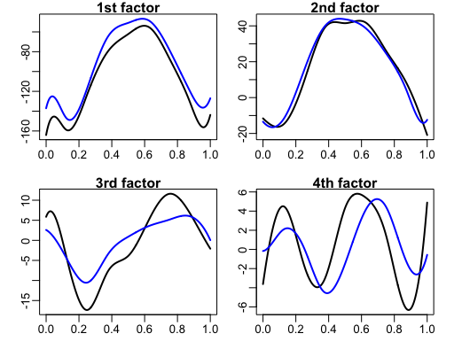
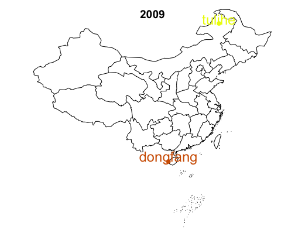

[](http://quantlet.de/index.php?p=info)

## [](http://quantlet.de/) **FASTEC_with_Expectiles** [](http://quantlet.de/d3/ia)

```yaml

Name of QuantLet : FASTEC_with_Expectiles

Published in : FASTEC-with-Expectiles

Description : 'Solves the optimization problem of smooth convex function with nonsmooth convex
regularizer by Fast Iterative Shrinkage Thresholding Algorithm. Uses the expectile loss function
and nuclear norm to do the factor analysis for the Chinese temperature data from 1957 to 2009.'

Keywords : expectile, loss function, optimization, nuclear norm, iterative, factor analysis

See also : FASTECSAMCVaR, FASTECChinaTemper2008

Author : Chen Huang, Shih-Kang Chao

Submitted : Thu, November 5 2015 by Chen Huang

Datafile : temperature_data.txt, stations_info.txt

```






```r

# clear history
rm(list = ls(all = TRUE))
graphics.off()

## install and load packages
libraries = c("splines", "maps", "mapdata", "matrixStats")
lapply(libraries, function(x) if (!(x %in% installed.packages())) {
    install.packages(x)
})
lapply(libraries, library, quietly = TRUE, character.only = TRUE)

## Function: FISTA algorithm
mer = function(Y, X, tau, lambda, epsilon = 10^(-6), itt = 2000) {
    ## Initialize
    m = ncol(Y)
    n = nrow(Y)
    p = ncol(X)
    L       = 2 * (m * n)^(-1) * max(tau, (1 - tau)) * norm(X, type = "F")^2
    Omega   = matrix(0, nrow = p, ncol = m)
    delta   = 1  # step size
    error   = 1e+07
    L.error = 1e+10
    it      = 1
    ## Output
    A       = matrix(0, nrow = p, ncol = m)
    A_      = matrix(0, nrow = p, ncol = m)
    ## Main iteration
    while (it < itt & error > epsilon) {
        S         = svd(Omega - L^(-1) * G.er(Omega, Y, X, tau), nu = p, nv = m)
        temp.sv   = S$d - (lambda/L)
        temp.sv[temp.sv < 0] = 0
        A         = S$u %*% diag(temp.sv, nrow = p, ncol = m) %*% t(S$v)
        delta.for = (1 + sqrt(1 + 4 * delta^2))/2
        Omega     = A + (delta - 1)/(delta.for) * (A - A_)
        error     = L.error - (sum((tau - matrix(as.numeric(Y - X %*% A < 0), n, m)) * 
            (Y - X %*% A)^2) + lambda * sum(temp.sv))
        L.error   = sum((tau - matrix(as.numeric(Y - X %*% A < 0), n, m)) * (Y - X %*% 
            A)^2) + lambda * sum(temp.sv)
        A_        = A
        delta     = delta.for
        it        = it + 1
        print(c(error, delta, sum((tau - matrix(as.numeric(Y - X %*% A < 0), n, m)) * 
            (Y - X %*% A)^2), sum(temp.sv)))
        # if(it < 10){error=1000000}
    }
    list(Gamma = A, d = S$d, U = S$u, V = S$v, error = error, loss = sum((tau - matrix(as.numeric(Y - 
        X %*% A < 0), n, m)) * (Y - X %*% A)^2), norm = sum(temp.sv), lambda = lambda, 
        iteration = it)
}
## Function: Computing the gradient of the expectile loss function
G.er = function(A, Y, X, tau) {
    m = ncol(Y)
    n = nrow(Y)
    p = ncol(X)
    w = 0
    G = matrix(0, p, m)
    for (r in 1:p) {
        for (s in 1:m) {
            for (i in 1:n) {
                u   = Y[i, s] - X[i, ] %*% A[, s]
                w   = w + (if (u > 0) {
                  2 * tau * u
                } else {
                  2 * (1 - tau) * u
                }) * X[i, r]
            }
            G[r, s] = (m * n)^(-1) * w
            w       = 0
        }
    }
    G
}

## Input Data setwd('...')
temper     = read.table("temperature_data.txt")
name       = read.table("stations_info.txt")
name.sta   = name$V2[-1]
lati       = name$V3[-1]
longi      = name$V4[-1]
name       = name[-1, ]
temper     = temper[-1, -1]
years      = c(1957:2009)
## Parameter
p          = ceiling(365^0.4)
n          = 365
for (year in 1:length(years)) {
    data   = temper[c((365 * year - 364):(365 * year)), ]
    ## Main Code
    xx     = seq(0, 1, length = 365)
    X.fac  = bs(xx, df = p, intercept = TRUE)
    X      = matrix(0, nrow = n, ncol = 0)
    for (i in 1:p) {
        X  = cbind(X, X.fac[, i])
    }
    k      = 0
    Y      = data.matrix(data)  # transform from data frame to matrix
    m      = dim(Y)[2]
    sig_x  = sqrt(norm(X, type = "F")/n)
    TAU    = c(0.01, 0.5, 0.99)
    
    ## Remove trend
    YY     = numeric(0)
    for (i in 1:m) {
        YY = c(YY, Y[, i])
    }
    XX        = rep(xx, times = m)
    fit.trend = smooth.spline(x = XX, y = YY)
    Y         = Y - fit.trend$y  # Remove trend
    ## Cross-validation for the tuning parameter
    cv.lambda    = function(lamb, X, Y, tau) {
        K        = 5
        ERR      = 0
        groupnum = floor(dim(X)[1]/K)
        for (k in 1:K) {
            err      = 0
            vali_ind = c((groupnum * k - groupnum + 1):(groupnum * k))
            vali_Y   = Y[-vali_ind, ]
            vali_X   = X[-vali_ind, ]
            train_X  = X[-vali_ind, ]
            train_Y  = Y[-vali_ind, ]
            fit      = mer(Y = train_Y, X = train_X, tau = tau, epsilon = 1e-06, lambda = lamb, 
                itt  = 1000)
            for (i in 1:n) {
                for (j in 1:m) {
                  err = c(err, fit$loss)
                }
            }
            err = sum(err)
            ERR = c(ERR, err)
        }
        ERR     = ERR[-1]
        mean(ERR)
    }
    
    lamb1 = optimize(cv.lambda, c(1e-07, 1), X = X, Y = Y, tau = TAU[1])$minimum
    lamb3 = optimize(cv.lambda, c(1e-07, 1), X = X, Y = Y, tau = TAU[3])$minimum
    
    system.time(fit1 <- mer(Y = Y, X = X, tau = TAU[1], epsilon = 1e-06, lambda = lamb1, 
        itt = 2000))
    system.time(fit3 <- mer(Y = Y, X = X, tau = TAU[3], epsilon = 1e-06, lambda = lamb3, 
        itt = 2000))
    
    ## Discussion
    
    ## Individual station plot
    
    cur1 = X %*% fit1$Gamma
    cur3 = X %*% fit3$Gamma
    
    ## variance explained
    pc1 = X %*% fit1$U %*% diag(fit1$d, nrow = p, ncol = m)
    pc3 = X %*% fit3$U %*% diag(fit3$d, nrow = p, ncol = m)
    
    varipc1 = colVars(pc1)
    varipc3 = colVars(pc3)
    
    ## adjust the order to match the variance portion
    pc1 = pc1[, order(varipc1, decreasing = TRUE)]
    pc3 = pc3[, order(varipc3, decreasing = TRUE)]
    
    ## New portion of variance
    varipc1n = colVars(pc1)
    varipc3n = colVars(pc3)
    portion1n = numeric(0)
    for (k in 1:8) {
        portion1n[k] = sum(varipc1n[1:k])/sum(varipc1n)
    }
    portion3n = numeric(0)
    for (k in 1:8) {
        portion3n[k] = sum(varipc3n[1:k])/sum(varipc3n)
    }
    
    par(mfrow = c(2, 2), oma = c(0, 1, 0, 0), mar = c(2, 1.8, 1, 0), mgp = c(1.5, 
        0.5, 0), xpd = NA)
    
    plot(xx, pc1[, 1], type = "l", lwd = 2, main = "1st factor", xlab = "", ylab = "", 
        ylim = c(min(pc1[, 1], pc3[, 1]), max(pc3[, 1], pc1[, 1])))
    lines(xx, pc3[, 1], lty = 1, lwd = 2, col = "blue")
    
    plot(xx, pc1[, 2], type = "l", lwd = 2, main = "2nd factor", xlab = "", ylab = "", 
        ylim = c(min(pc3[, 2], pc1[, 2]), max(pc1[, 2], pc3[, 2])))
    lines(xx, pc3[, 2], lty = 1, lwd = 2, col = "blue")
    
    plot(xx, pc1[, 3], type = "l", lwd = 2, main = "3rd factor", xlab = "", ylab = "", 
        ylim = c(min(pc1[, 3], pc3[, 3]), max(pc3[, 3], pc1[, 3])))
    lines(xx, pc3[, 3], lty = 1, lwd = 2, col = "blue")
    
    plot(xx, pc1[, 4], type = "l", lwd = 2, main = "4th factor", xlab = "", ylab = "", 
        ylim = c(min(pc3[, 4], pc1[, 4]), max(pc1[, 4], pc3[, 4])))
    lines(xx, pc3[, 4], lty = 1, lwd = 2, col = "blue")
    
    ## Loadings on factors
    load1 = t(fit1$V)[order(varipc1, decreasing = TRUE), ]
    load3 = t(fit3$V)[order(varipc3, decreasing = TRUE), ]
    
    ## tau spread analysis
    par(mfrow = c(1, 1), oma = c(1, 1, 0, 0), mar = c(2, 1.8, 0, 0), mgp = c(1.5, 
        0.5, 0), xpd = NA)
    standout = c(159)
    plot(load1[1, ], load3[1, ], col = "white", xlab = "Loadings on factor 1 of 1% tau level", 
        ylab = "Loadings on factor 1 of 99% tau level", cex.lab = 1.2)
    points(sort(load1[1, ]), load3[1, order(load1[1, ])], pch = 20, col = rgb(as.numeric(data.matrix(longi[order(load1[1, 
        ])]))/max(as.numeric(data.matrix(longi))), as.numeric(data.matrix(lati[order(load1[1, 
        ])]))/max(as.numeric(data.matrix(lati))), rep(0, 159)))
    text(sort(load1[1, ])[standout] - 0.01, load3[1, order(load1[1, ])][standout] + 
        0.02, labels = name.sta[order(load1[1, ])][standout], cex = 1.2, col = rgb(as.numeric(data.matrix(longi[order(load1[1, 
        ])[standout]]))/max(as.numeric(data.matrix(longi))), as.numeric(data.matrix(lati[order(load1[1, 
        ])[standout]]))/max(as.numeric(data.matrix(lati))), 0))
    text(load1[1, order(load3[1, ])][standout] + 0.05, sort(load3[1, ])[standout], 
        labels = name.sta[order(load3[1, ])][standout], cex = 1.2, col = rgb(as.numeric(data.matrix(longi[order(load3[1, 
            ])[standout]]))/max(as.numeric(data.matrix(longi))), as.numeric(data.matrix(lati[order(load3[1, 
            ])[standout]]))/max(as.numeric(data.matrix(lati))), 0))
    text(sort(load1[1, ])[1], load3[1, order(load1[1, ])][1] - 0.005, labels = name.sta[order(load1[1, 
        ])][1], cex = 1.2, col = rgb(as.numeric(data.matrix(longi[order(load1[1, 
        ])[1]]))/max(as.numeric(data.matrix(longi))), as.numeric(data.matrix(lati[order(load1[1, 
        ])[1]]))/max(as.numeric(data.matrix(lati))), 0))
    
    ## Plot the compass
    par(mfrow = c(1, 1), oma = c(1, 1, 0, 0), mar = c(2, 1.8, 0, 0), mgp = c(1.5, 
        0.5, 0), xpd = NA)
    plot(seq(min(as.numeric(data.matrix(longi)))/max(as.numeric(data.matrix(longi))), 
        1, len = 100), seq(min(as.numeric(data.matrix(lati)))/max(as.numeric(data.matrix(lati))), 
        1, len = 100), col = "white", axes = FALSE, xlab = "", ylab = "", type = "l", 
        asp = 1, xlim = c(0, 1.5), ylim = c(0, 1.5))
    x = rep(seq(min(as.numeric(data.matrix(longi)))/max(as.numeric(data.matrix(longi))), 
        1, len = 100), 100)
    y = rep(0, 10000)
    for (i in 1:100) {
        y[((i - 1) * 100 + 1):(i * 100)] = seq(min(as.numeric(data.matrix(longi)))/max(as.numeric(data.matrix(longi))), 
            1, len = 100)[i]
    }
    points(x, y, col = rgb(x, y, rep(0, 10000)))
    lines(seq(min(x) - 0.1, max(x) + 0.1, len = 10000), rep(median(y), 10000))
    lines(rep(median(x), 10000), seq(min(y) - 0.1, max(y) + 0.1, len = 10000))
    text(min(x) - 0.2, median(y), labels = "W", cex = 1.5)
    text(max(x) + 0.2, median(y), labels = "E", cex = 1.5)
    text(median(x), min(y) - 0.2, labels = "S", cex = 1.5)
    text(median(x), max(y) + 0.2, labels = "N", cex = 1.5)
    
    ## Three sample extreme locations on map
    index = c(order(load1[1, ])[standout], order(load3[1, ])[standout], order(load1[1, 
        ])[1])
    x.cor = as.numeric(data.matrix(name$V4)[c(order(load1[1, ])[standout], order(load3[1, 
        ])[standout], order(load1[1, ])[1])])/100
    y.cor = as.numeric(data.matrix(name$V3)[c(order(load1[1, ])[standout], order(load3[1, 
        ])[standout], order(load1[1, ])[1])])/100
    
    par(mfrow = c(1, 1), oma = c(1, 1, 0, 0), mar = c(2, 1.8, 0, 0), mgp = c(1.5, 
        0.5, 0), xpd = NA)
    map("china")
    points(x.cor, y.cor, lwd = 0.5, pch = 20, col = rgb(x.cor * 100/max(as.numeric(data.matrix(longi[order(load1[1, 
        ])]))), y.cor * 100/max(as.numeric(data.matrix(lati[order(load1[1, ])]))), 
        rep(0, 3)), cex = 1.5)
    for (i in 1:3) {
        text(x.cor[i], y.cor[i] + 0.9, labels = name.sta[index[i]], col = rgb(x.cor[i] * 
            100/max(as.numeric(data.matrix(longi[order(load1[1, ])]))), y.cor[i] * 
            100/max(as.numeric(data.matrix(lati[order(load1[1, ])]))), 0), cex = 1.5)
    }
    title(main = years[year])
} 

```
